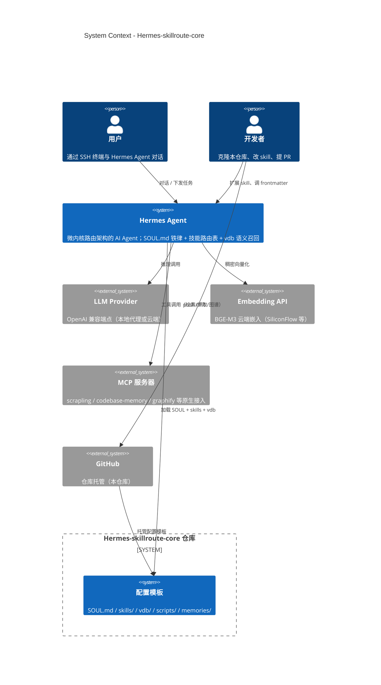
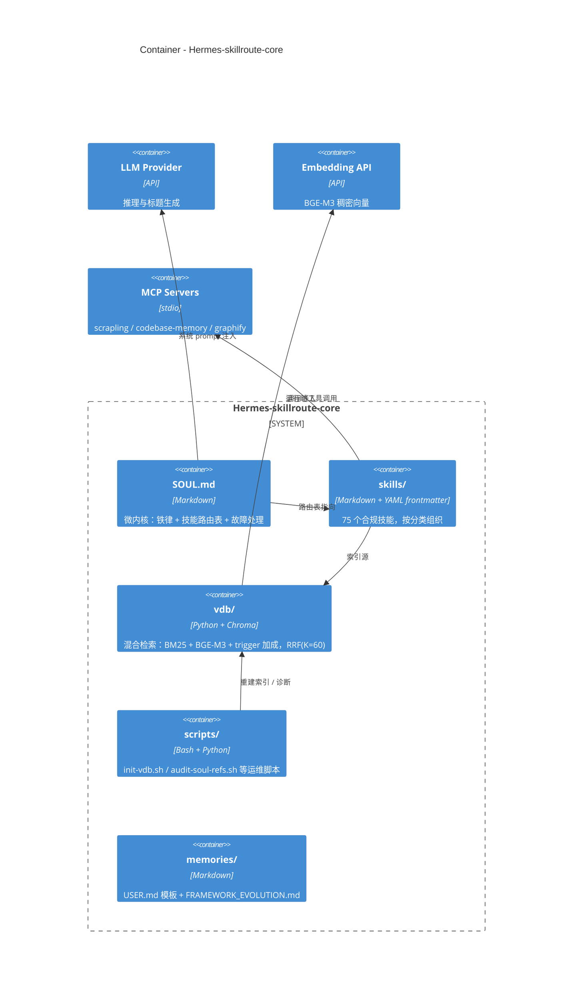
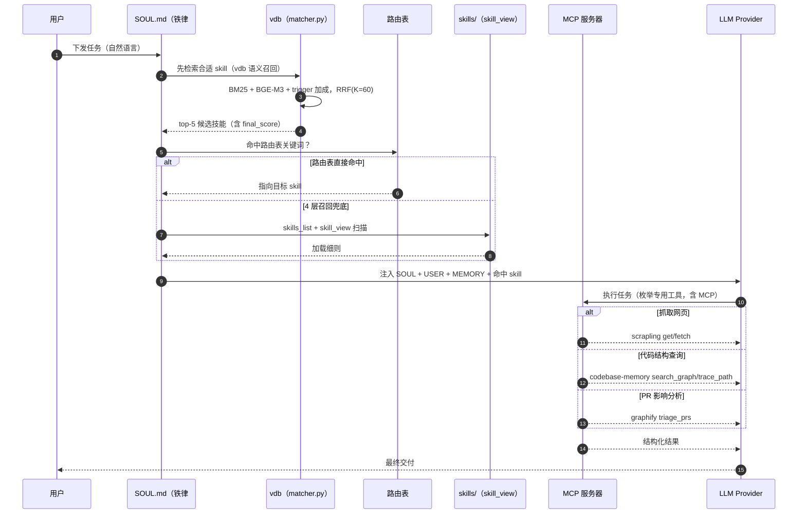

# Hermes-skillroute-core 架构

本仓库是 Hermes Agent 微内核架构的配置模板。本文档用 [C4 模型](https://c4model.com/)（参考 [softaworks/agent-toolkit](https://github.com/softaworks/agent-toolkit) 的 C4 实践）描述系统边界与内部容器，并附一张检索/路由流的时序图，展示核心价值：**技能路由 + MCP 调用链**。

> GitHub 原生渲染 Mermaid，无需额外工具链。修改本文即可更新图——这是「文档跟得上代码」的关键。

## 1. System Context（系统上下文）

谁在与系统交互，系统依赖什么外部能力。

## 2. Container（容器 / 模块边界）

仓库内部结构，按职责切分。

## 3. 检索 / 路由流（时序图）

展示一次「用户提问 → 技能路由 → 工具调用」的完整链路。这是本仓库的核心价值。

## 4. 设计原则（与图对应）

| 原则 | 图中的位置 |
|------|-----------|
| 微内核：SOUL 只留铁律 + 路由表 | `SOUL.md` 容器，细则全在 `skills/` |
| 4 层召回无单点依赖 | 时序图 step 4-7（vdb → 路由表 → available_skills → skill_view） |
| 工具选型效率优先 | 时序图 step 11-14（MCP 专用工具优先于原始手段） |
| 配置与代码分离 | `memories/USER.md` 个性化，不入库；`skills/` 是元数据真源 |
| 脱敏：本仓库零个人数据 | 所有路径/IP/模型名已清洗为占位 |

## 参考借鉴

- [softaworks/agent-toolkit — c4-architecture skill](https://github.com/softaworks/agent-toolkit) — C4 模型 Mermaid 实践
- [NousResearch/hermes-agent Issue #486 — Code Wiki Skill](https://github.com/NousResearch/hermes-agent/issues/486) — 自动生成 `architecture.md` 的思路
- [mermaid.js — Architecture Diagrams](https://mermaid.js.org/syntax/architecture.html) — 图表语法参考
